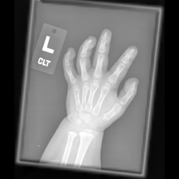
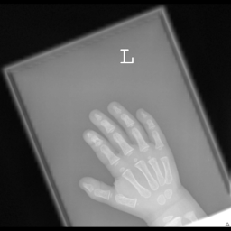
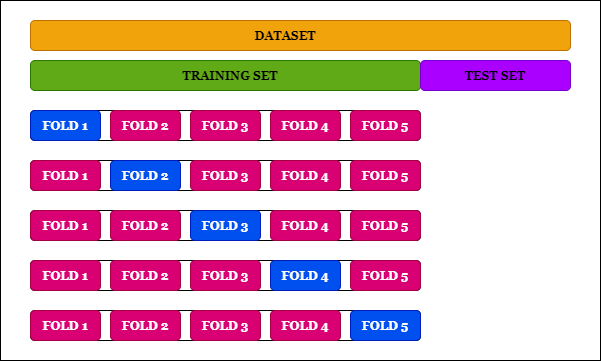
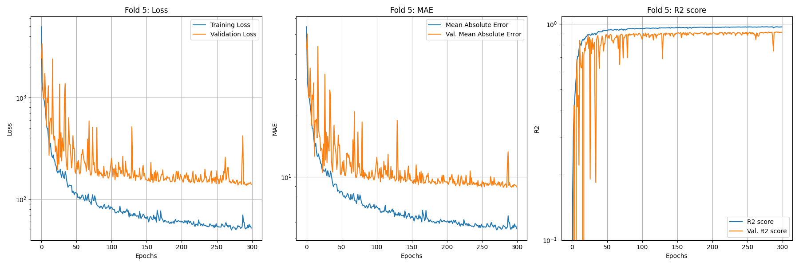
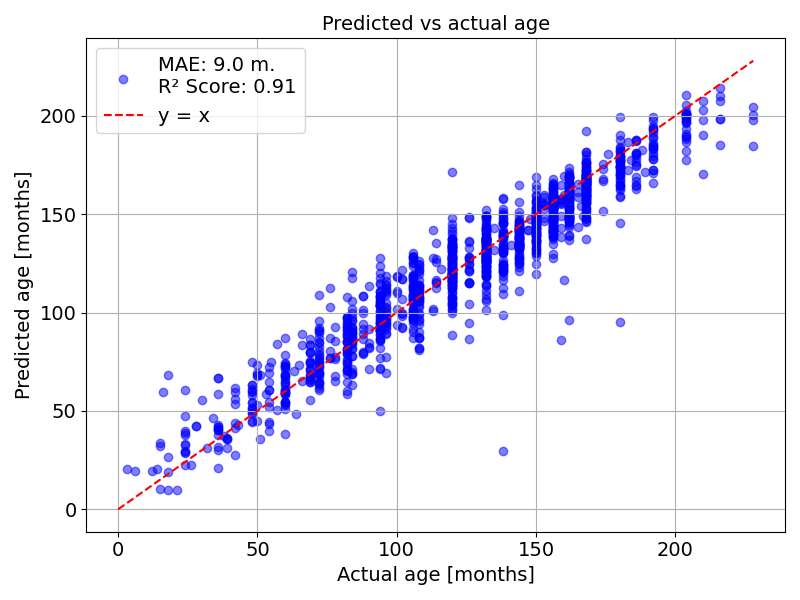
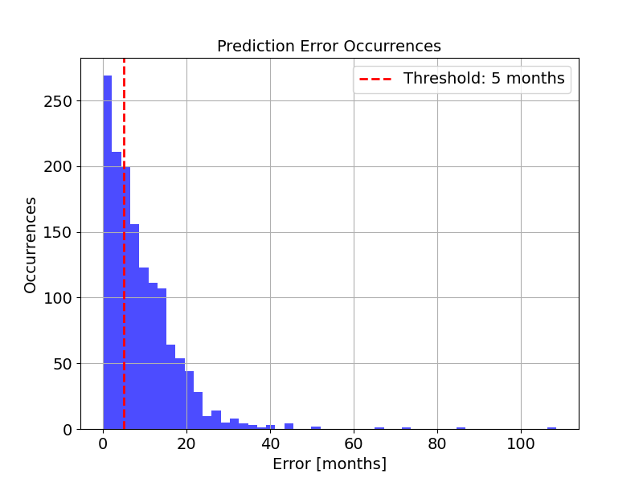
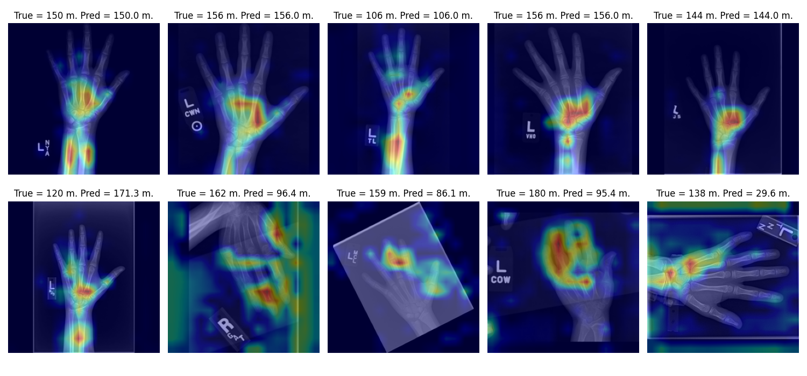

# Bone age Regression

[](https://boneage-regression.readthedocs.io/en/latest/?badge=latest)


The aim of this reporsitory is to build and train a convolutional neural network (CNN) for a deep learning based regression. Starting from hands x-rays the CNN will be able to infer patiences' ages. This project is developed using both Python and Matlab scripts.

# Table of contents
+ [Classes](#Classes)
+ [Data](#Data)
  + [Preprocessing](#Preprocessing)
+ [Model building and training](#Model-building-and-training)
  + [Hypermodel](#Hypermodel)
+ [Results](#Results)
  + [Heat Map](#Heat-Map)
+ [Usage](#Usage)

# Classes
In order to improve readability by performing encapsulation we build up two classes: one to handle data and another to handle the model. <br>
- `Data`: this class is designed to combine each image with its label, discard images without labels and viceversa and perform preprocessing (this function could be deactivated); <br>
- `Model`: on the other hand this class takes input data, trains the model and plots precidctions.

# Data
The dataset is composed of 14233 images, coming from patiences whose age range from 0 to 216 months. The 46% of the patinces are female (label "0") and 54% are male (label "1") and the mean age is 127 months.
You are able to download data yourself using the following link: https://www.rsna.org/rsnai/ai-image-challenge/RSNA-Pediatric-Bone-Age-Challenge-2017

## Preprocessing
The image are on greyscale but the size and the pixels intensity are different from one image to another. To stardize the dataset we renormalize the images from 0 and 1 exploiting two features which are always present in the images: the background, darker than the hand (and then set to "0"); a white letter, lighter than the hand (and then set to "1"). 
Secondly we cut as much background as we can in order to center the hand. 
Thirdly we padded images in order to make them squared.
Lastly we resized them from whatever their dimension was to 256x256 in order to be able to pass them to the CNN.
The preprocessing was implemented using Matlab.
Some examples of processed and unprocessed fotos follows.

<div align="center">

| **Unpreprocessed** | **Preprocessed** |
|--------------------|------------------|
|  |  |

</div>

<div align="center">

| **Unpreprocessed** | **Preprocessed** |
|--------------------|------------------|
|  |  |

</div>

<div align="center">

| **Unpreprocessed** | **Preprocessed** |
|--------------------|------------------|
|  |  |

</div>

<div align="center">

| **Unpreprocessed** | **Preprocessed** |
|--------------------|------------------|
|  |  |

</div>

# Model building and training
 The process of model building and model training follows three main steps: <br>
 • First a k-fold validation is performed on the training set. <br>
 • Inside each fold hyperparameters optimization is performed  using Bayesian search of `Keras Tuner` (exploring the user-selected `searching_fraction` of the hyperparameters' space) and the best model is trained for 300 epochs. Hyperparameter optimization can be skipped setting the parameter `overwrite` to `False`.  By doing so, the hyperparameters for each fold will be set to pre-saved values contained in the `Tuner` folder without any new search. <br>
 • At the end of this process we are left with 5 trained models, where each one is the best model in his fold. The final model is selected as
the model with the minimum MSE in the test set. <br>

The splitting of the dataset is summarized in the following figure:
<div align="center">
 <br>
</div>

## Hypermodel
The hypermodel consists of a variable number of convolutional blocks (`Conv2D`, `BatchNormalization` and `MaxPooling`), followed by a `Flatten` and a `Dense` (plus `BatchNormalization`) layers. The output is then concatenated with the gender features. Following there are a variable number of `Dense` plus `Dropout` layers and a final `Dense` layer with linear activation. <br>

The user can insert custom values for the hyperparameters tuning. Namely the hyperparameters are: <br>
• `Conv. layers`: number of convolutional layers of the network. <br>
• `Conv. filters`: number of convolutional filters in the first conv. layer. The number of conv. filters grows linearly each successive layer.<br>
• `Dense depth`: number of dense layer(s) after feature concatenation. The number of neurons in the first layer is set to 256 and is halved for each subsequent dense layer. <br>
• `Dropout rate`: dropout rate of the final dense layer(s). <br>

The default hyperparameters values are shown in the following table: <br>

<div align="center">

| Hyperparameters   |     Values      | 
| ----------------  | ----------------|
| `conv_layers`     |  3, 4, 5        | 
| `conv_filters`    |  8, 16, 32      | 
| `dense_depth`     |  1, 3, 5        | 
| `dropout_rate`    |  0.1, 0.2, 0.3  | 

</div>

# Results 
We conclude showing an example of the output images provided by our code.
- Learning Curves recorded for one fold:
<div align="center">
  
</div>

- Predictions on the test set:
<div align="center">
  
</div>

- Predictions distribution, a reference error of 5 months is also shown:
<div align="center">
 
</div>

## Heat Map
As part of the analysis, we include the possibility to "visualize" what the model has learnt using a heat map, which highlights the regions of input images which are relevant in the decision making process.
Here are some examples:



# Usage
Simply download this repository and run using default parameters.
```python
cd boneage_regression\boneage_regression
python main.py
```
In case you are running this code for the first time remember to install the requirements.
```python
pip install -r requirements.txt
```

In order to select custom parameters, refer to the help:
```python
python main.py -h

usage: main.py [-h] [-fp] [-p] [-o] [-cl  [...]] [-cf  [...]] [-dd  [...]] [-dr  [...]] [-sf]

This script performs bone age prediction using a machine learning regression model. It accepts input parameters for model configuration and the
dataset folder path. If you pass a dataset folder remember that it must contain: 1) Two separate folders for training and test images named 'Training'
and 'Test'. 2) Two .csv files with the corresponding labels named 'training.csv' and 'test.csv'. Each CSV file must contain three columns named 'ID',
'boneage', 'male'.

options:
  -h, --help            show this help message and exit
  -fp , --folder_path   Path to the directory containing training and test images as well as csv files with the labels. Default: Preprocessed_images
  -p , --preprocessing  If False avoid image preprocessing. Default: False
  -ot , --overwrite_tuner 
                        If False avoid hyperparameters search and use the pre-saved hyperpar. Default: False
  -om , --overwrite_model 
                        If False skip training and load pre-trained models. Default: False
  -cl  [ ...], --conv_layers  [ ...]
                        List of values for the hypermodel number of conv2d layers Default [3, 4, 5]
  -cf  [ ...], --conv_filters  [ ...]
                        List of values for the hypermodel first conv2d number of filters. Default [8, 16, 32]
  -dd  [ ...], --dense_depth  [ ...]
                        List of values for the hypermodel depth of final dense layers Default [1, 2, 3]
  -dr  [ ...], --dropout_rate  [ ...]
                        List of values for the dropout rate of the final dense layers Default [0.1, 0.2, 0.3]
  -sf , --searching_fraction 
                        Fraction of the hyperparameters space explored during hypermodel search. Default: 0.25
```

Plese note that in order to be able to preprocess the images you must have **`Matlab`** and the `Python` module **`matlab.engine`** installed (they are **not** included in the project's requirements). 
If you want to run the code without installing **`Matlab`** and **`matlab.engine`**, simply run the script using the default values for `folder_path` (`Preprocessed_images`) and `preprocessing` (`False`), this will skip the preprocessing using already preprocessed images in the `Preprocessed_images` folder.

In order to pass a list of hyperparameters, separate them with a space like this:
```python
python main.py -cl 2 3 -cf 32 -dd 1 2 -dr 0.2 0.3
```

All the images produced by the code will be automatically saved in a folder named `Plots`. 

If the code breaks of you want to interrupt the code and resume it later (even though we discourage doing so) re-run it  using default values for `overwrite_tuner` (`False`) and `overwrite_model` (`False`). By doing this the code will resume from where it left off.

## Attribution

This work builds upon the research presented in the following paper:

- **Halabi SS, Prevedello LM, Kalpathy-Cramer J, et al.** (2018). The RSNA Pediatric Bone Age Machine Learning Challenge. *Radiology*, 290(2), 498-503. [DOI](https://doi.org/10.1148/radiol.2018180736).

For more details, please refer to the original paper.

The original dataset can be downloaded at https://www.rsna.org/rsnai/ai-image-challenge/rsna-pediatric-bone-age-challenge-2017


