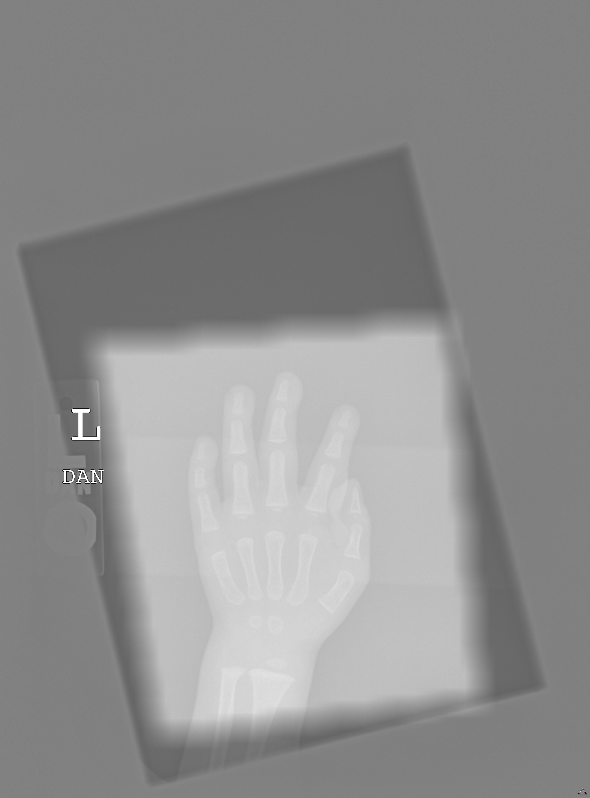
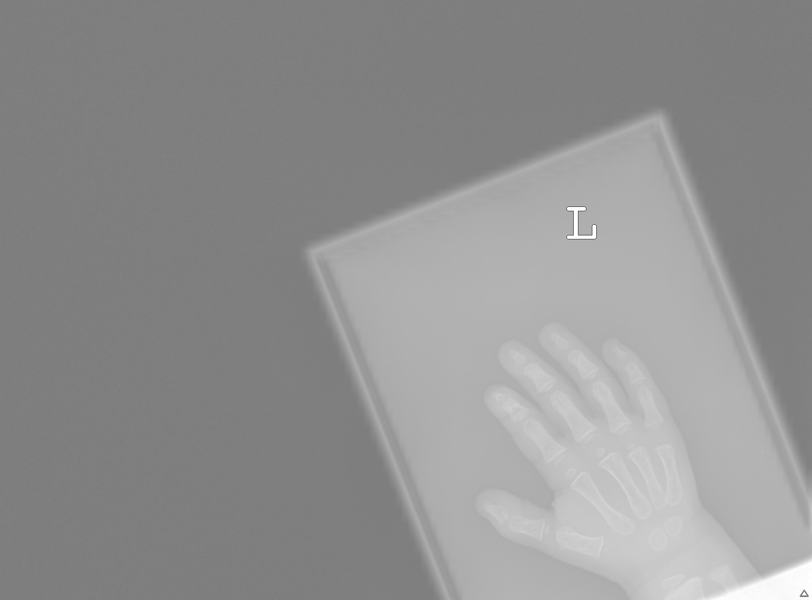

# Bone age Regression

[](https://boneage-regression.readthedocs.io/en/latest/?badge=latest)


The aim of this reporsitory is to build and train a convolutional neural network (CNN) for a deep learning based regression. Starting from hands x-rays the CNN will be able to infer patiences' ages. This neaural network will be developed using both Python and Matlab.
# Table of contents
+ [Data](#Data)
  + [Preprocessing](#Preprocessing)
+ [Neural Network](#Neural_Network)
  + [Classes](#Classes)
+ [Results](#Results)
  + [Heat Map](#Heat_Map)
+ [Usage](#Usage)  


# Data
The dataset is composed of 14233 images, coming from patiences whose age range from 0 to 216 months. The 46% of the patinces are female (label "0") and 54% are male (label "1") and the mean age is 127 months.
You are able to download data yourself using the following link: https://www.rsna.org/rsnai/ai-image-challenge/RSNA-Pediatric-Bone-Age-Challenge-2017

## Preprocessing
The image are on greyscale but the size and the pixels intensity are different from one image to another. To stardize the dataset we renormalize the images from 0 and 1 exploiting to features which are always present in the images: the background, darker than the hand (and then set to "0"); a white letter, lighter than the hand (and then set to "1"). 
Secondly we cut as much background as we can in order to center the hand. 
Thirdly we padded images in order to obtain squared ones.
Lastly we resized them from whatever their dimension was to 256x256 in order to be able to pass them to the CNN.
The preprocessing was implemented using Matlab.
Some examples of processed and unprocessed fotos follows.

<div align="center">

| **Unpreprocessed** | **Preprocessed** |
|--------------------|------------------|
|  |  |

</div>

<div align="center">

| **Unpreprocessed** | **Preprocessed** |
|--------------------|------------------|
|  |  |

</div>

<div align="center">

| **Unpreprocessed** | **Preprocessed** |
|--------------------|------------------|
|  |  |

</div>

<div align="center">

| **Unpreprocessed** | **Preprocessed** |
|--------------------|------------------|
|  |  |

</div>

# Neural Network

## Hypermodel
The user can insert custom values for the hyperparameters tuning. Namely the hyperparameters are: <br>
• `Conv. layers`: number of convolutional layers of the network. <br>
• `Conv. filters`: number of convolutional filters in the first conv. layer. The number of conv. filters doubles with each successive layer.<br>
• `Dense depth`: number of dense layer(s) after feature concatenation. <br>
• `Dropout rate`: dropout rate of the final dense layer(s). <br>

## Classes
In order to improve readability by performing encapsulation we build up two classes: one to handle data and another to handle the model.
- Data: this class is designed to combine each image with its label, discard images without labels and viceversa and perform preprocessing (this function could be deactivated);
- Model: on the other hand this class takes input data and train a model (whose hyperparameters can also be searched).

# Results 
## Heat Map
As part of the analysis, we include the possibility to "visualize" what the model has learnt using a heat map, which highlights the regions of input images which are relevant in the decision making process.
Here are some examples:

# Usage
Simply download this repository and run using default parameters.
```python
cd boneage_regression\boneage_regression
python main.py
```
In case you are running this code for the first time remember to install the requirements.
```python
pip install -r requirements.txt
```

## Attribution

This work builds upon the research presented in the following paper:

- **Halabi SS, Prevedello LM, Kalpathy-Cramer J, et al.** (2018). The RSNA Pediatric Bone Age Machine Learning Challenge. *Radiology*, 290(2), 498-503. [DOI](https://doi.org/10.1148/radiol.2018180736).

For more details, please refer to the original paper.

The original dataset can be downloaded at https://www.rsna.org/rsnai/ai-image-challenge/rsna-pediatric-bone-age-challenge-2017


